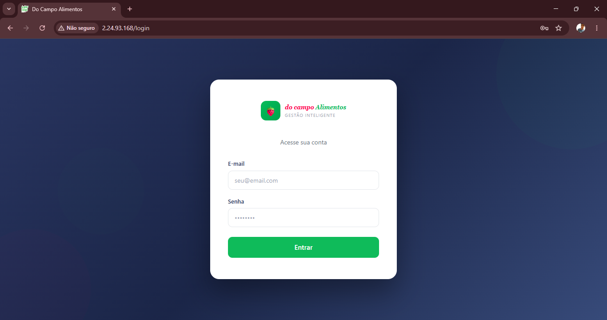
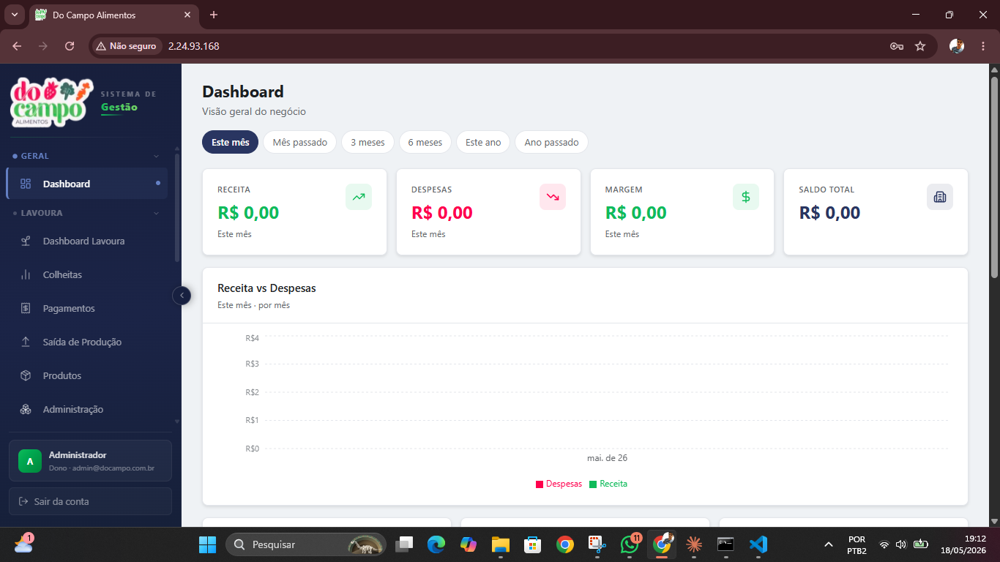
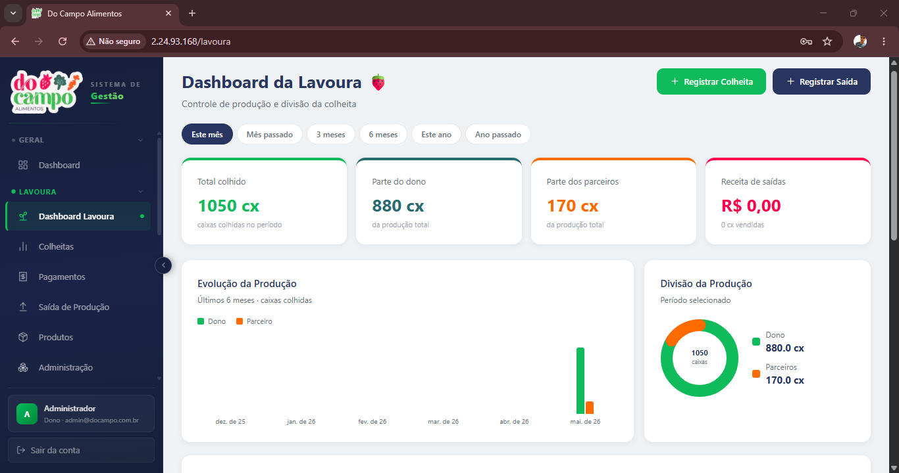
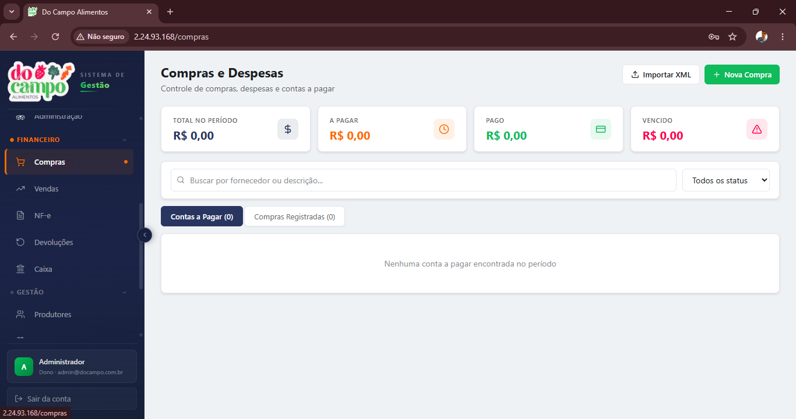

# Do Campo Alimentos — Sistema de Gestão

Sistema ERP completo desenvolvido como freela para um hortifruti e floricultura. Cobre desde o controle de lavoura e colheita até vendas, financeiro e emissão de NF-e.

**Em produção** — sistema rodando para o cliente.

## Screenshots






## Módulos

**Lavoura**
- Registro de colheita por produtor
- Controle de saída de produtos da lavoura
- Histórico de pagamentos aos produtores
- Timeline de produção

**Comercial**
- Vendas com registro de pagamento
- Compras e devoluções
- Clientes e fornecedores
- Romaneios de carga

**Financeiro**
- Contas a receber
- Fechamento de caixa
- Dashboard com resumo financeiro
- Relatórios exportáveis
- Impressão de comprovantes

**Operacional**
- Controle de estoque
- Cadastro de produtos e produtores
- Gestão de usuários com controle de acesso
- NF-e (Nota Fiscal eletrônica)
- Integração com WhatsApp

## Stack

- **Front-end:** Next.js 16, React 19, TypeScript, Tailwind CSS, shadcn/ui
- **Back-end:** Next.js API Routes, Prisma ORM
- **Banco de dados:** PostgreSQL
- **Auth:** NextAuth v5 com Prisma Adapter, bcryptjs
- **Outros:** React Hook Form, Zod, Recharts, html2canvas

## Como rodar

**Pré-requisitos:** Node.js 18+, PostgreSQL

```bash
npm install

cp .env.example .env
# Configure DATABASE_URL, AUTH_SECRET e demais variáveis

npx prisma migrate dev

npm run dev
```

Acesse `http://localhost:3000`

## Estrutura

```
app/
├── (dashboard)/     # Módulos do sistema (vendas, estoque, lavoura...)
├── api/             # Endpoints REST por módulo
├── actions/         # Server Actions (auth)
└── imprimir/        # Páginas de impressão de documentos
```
